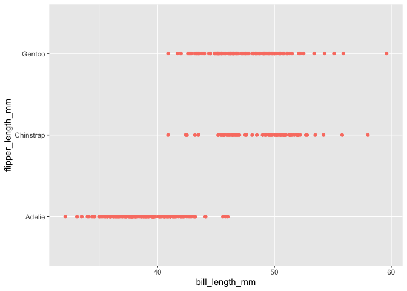

HW1
================
jiaying Ning
9/15/2020

This is my solution to HW1

*Note*

1.meaningful variable / object names 2.readable code (one command per
line; adequate whitespace and indentation; etc) 3.clearly-written text
to explain code and results 4.a lack of superfluous code (no unused
variables are defined; no extra library calls;
    ect)

``` r
library(tidyverse)
```

    ## ── Attaching packages ───────────────────────────────────────────── tidyverse 1.3.0 ──

    ## ✓ ggplot2 3.2.1     ✓ purrr   0.3.3
    ## ✓ tibble  3.0.3     ✓ dplyr   0.8.3
    ## ✓ tidyr   1.0.0     ✓ stringr 1.4.0
    ## ✓ readr   1.3.1     ✓ forcats 0.4.0

    ## ── Conflicts ──────────────────────────────────────────────── tidyverse_conflicts() ──
    ## x dplyr::filter() masks stats::filter()
    ## x dplyr::lag()    masks stats::lag()

## problem 1

For problem 1, I start off by creating tables that contain a random
sample of size 10 from a standard Normal distribution, a logical vector
indicating whether elements of the sample are greater than 0,a character
vector of length 10,a factor vector of length 10, with 3 different
factor
“levels”

``` r
#Creating tables that contain a random sample of size 10 from a standard Normal distribution, a logical vector indicating whether elements of the sample are greater than 0,a character vector of length 10,a factor vector of length 10, with 3 different factor “levels”
Problem1_df =  tibble(
  vec1 = rnorm(10),
  vec2 = vec1 > 0,
  vec3 = c("a","b","c","d","e","f","g","h","i","j"),
  vec4 = factor(c("low","low","low","Med","Med","Med","Med","High","High","High"))
  )
```

Then I take means for each
    vector

``` r
mean(pull(Problem1_df,vec1))
```

    ## [1] -0.1197474

``` r
mean(pull(Problem1_df,vec2))
```

    ## [1] 0.5

``` r
mean(pull(Problem1_df,vec3))
```

    ## Warning in mean.default(pull(Problem1_df, vec3)): argument is not numeric or
    ## logical: returning NA

    ## [1] NA

``` r
mean(pull(Problem1_df,vec4))
```

    ## Warning in mean.default(pull(Problem1_df, vec4)): argument is not numeric or
    ## logical: returning NA

    ## [1] NA

I can take mean of numerical and logical number, but not character or
factor.

applies the as.numeric function to the logical, character, and factor
variables

``` r
as.numeric(pull(Problem1_df,vec1))
```

    ##  [1] -2.5315953  0.8200457  0.8604696 -0.6794358  0.4988710 -0.8200131
    ##  [7] -0.2187056  0.4663219  0.8691200 -0.4625529

``` r
as.numeric(pull(Problem1_df,vec2))
```

    ##  [1] 0 1 1 0 1 0 0 1 1 0

``` r
as.numeric(pull(Problem1_df,vec3))
```

    ## Warning: NAs introduced by coercion

    ##  [1] NA NA NA NA NA NA NA NA NA NA

``` r
as.numeric(pull(Problem1_df,vec4))
```

    ##  [1] 2 2 2 3 3 3 3 1 1 1

convert the logical vector to numeric, and multiply the random sample by
the result convert the logical vector to a factor, and multiply the
random sample by the result convert the logical vector to a factor and
then convert the result to numeric, and multiply the random sample by
the
    result

``` r
as.numeric(pull(Problem1_df,vec2))*pull(Problem1_df,vec1)
```

    ##  [1] 0.0000000 0.8200457 0.8604696 0.0000000 0.4988710 0.0000000 0.0000000
    ##  [8] 0.4663219 0.8691200 0.0000000

``` r
as.factor(pull(Problem1_df,vec2))*pull(Problem1_df,vec1)
```

    ## Warning in Ops.factor(as.factor(pull(Problem1_df, vec2)), pull(Problem1_df, :
    ## '*' not meaningful for factors

    ##  [1] NA NA NA NA NA NA NA NA NA NA

``` r
as.numeric(as.factor(pull(Problem1_df,vec2)))*pull(Problem1_df,vec1)
```

    ##  [1] -2.5315953  1.6400915  1.7209393 -0.6794358  0.9977421 -0.8200131
    ##  [7] -0.2187056  0.9326438  1.7382401 -0.4625529

## problem 2

load the penguins dataset

``` r
data("penguins", package = "palmerpenguins")
x= na.omit(pull(penguins,flipper_length_mm))
```

There are 8 variables in the dataset “penguins”

they are

  - species, island, bill\_length\_mm, bill\_depth\_mm,
    flipper\_length\_mm, body\_mass\_g, sex, year

with corresponding class of:

  - factor, factor, numeric, numeric, integer, integer, factor, integer.

The data contains total of 344 observations. The mean flipper length is
200.9152047mm.

Below is a scatterplot of flipper\_length\_mm (y) vs bill\_length\_mm
(x); color points using the species variable I have saved the plot by
using
ggsave

``` r
ggplot(data=penguins,mapping=aes(bill_length_mm,flipper_length_mm)) + geom_point(data=penguins, aes(bill_length_mm,species),colour = "salmon")
```

    ## Warning: Removed 2 rows containing missing values (geom_point).

<!-- -->

``` r
ggsave("scatter_plot.pdf", height = 4, width = 6)
```

    ## Warning: Removed 2 rows containing missing values (geom_point).
